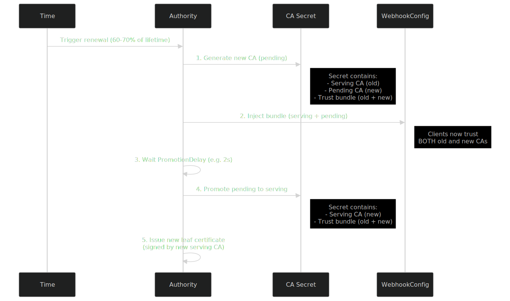

# webhook-cert-lib

`webhook-cert-lib` is a Golang library designed to simplify the management of certificates for Kubernetes Webhooks (Validating, Mutating, or Conversion webhooks). It handles the creation, rotation, and injection of Certificate Authorities (CA) and leaf certificates, ensuring your webhooks function securely and reliably.

> **Note**: This project is under development and APIs may change.

## Features

- **Automatic CA Management**: Generates and rotates CA certificates automatically.
- **CA Injection**: Injects the CA bundle into `ValidatingWebhookConfiguration`, `MutatingWebhookConfiguration`, and `CustomResourceDefinition` (CRD) resources.
- **Leaf Certificate Management**: Issues and rotates leaf certificates for the webhook server.
- **Zero-Downtime Rotation**: Implements a pending-CA promotion strategy to ensure all clients have the new CA before it is used for signing.
- **High Availability Support**: Designed to run with multiple replicas of the controller, with little contention between instances.

## Architecture

The following diagram illustrates how the `Authority` controller interacts with Kubernetes resources to secure your webhook:

<!-- use `make generate-diagrams` to generate the diagram -->


## Installation

```bash
go get github.com/cert-manager/webhook-cert-lib
```

## Usage

See [./examples/webhook-controller](./examples/webhook-controller) for a complete example.

### 1. Initialize Authority

Create an `Authority` instance using your Kubernetes config or clientset.

```go
import (
    "time"

    "github.com/cert-manager/webhook-cert-lib/pkg/authority"
    "k8s.io/apimachinery/pkg/types"
    "k8s.io/client-go/rest"
)

func main() {
    cfg, _ := rest.InClusterConfig()

    opts := authority.AuthorityOptions{
        AuthorityCertificate: authority.AuthorityCertificateOptions{
            SecretNamespacedName: types.NamespacedName{
                Namespace: "my-namespace",
                Name: "my-webhook-ca",
            },
            Duration:             1 * time.Hour, // Optional: Default 1h
        },

        // Optional: Default 2s
        PromotionDelay: 2 * time.Second,

        ServerCertificate: authority.ServerCertificateOptions{
            DNSNames: []string{"my-service.my-namespace.svc"},
            Duration: 1 * time.Hour, // Optional: Default 1h
        },
    }

    auth, err := authority.NewAuthorityForConfig(cfg, opts)
    if err != nil {
        panic(err)
    }

    // ...
}
```

### 2. Configure TLS Server

Use the `ServingCertificate` method to hook into your Go `http.Server` or `listener`.

```go
    tlsConfig := &tls.Config{}
    auth.ServingCertificate(tlsConfig)

    server := &http.Server{
        Addr:      ":9443",
        TLSConfig: tlsConfig,
    }
```

### 3. Run the Authority

Run the authority in a separate goroutine or manage it with a context.

```go
    ctx := context.Background()
    go func() {
        if err := auth.Start(ctx); err != nil {
            panic(err)
        }
    }()

    server.ListenAndServeTLS("", "")
```

## How the Controller Works

### CA Rotation Lifecycle

To ensure zero downtime, the controller uses a "Pending CA" strategy. This allows the new CA to be distributed to all clients (via the `ValidatingWebhookConfiguration` CA bundle) *before* it is used to sign the serving certificate.

<!-- use `make generate-diagrams` to generate the diagram -->


1.  **Issue Pending CA**: Generate a new CA (pending) and store it in the CA Secret alongside the current serving CA.
2.  **Inject Bundle**: Update webhook resources (e.g., `ValidatingWebhookConfiguration`, `MutatingWebhookConfiguration`, CRDs) with the combined trust bundle (old + new).
3.  **Promotion Delay**: Wait `PromotionDelay` (default 2s) to allow the new bundle to propagate.
4.  **Promote CA**: Promote the pending CA to be the serving CA.
5.  **Rotate Leaf Cert**: Issue new leaf certificate signed by the new serving CA.
6.  **Cleanup**: Remove the old CA from the trust bundle and injected resources when it is no longer required.

### Multi-Replica Coordination

When the controller detects the serving CA needs renewal it attempts to create a pending CA; only one instance will succeed. Each instance has a unique `authorityID`. The instance that issues the pending CA is responsible for injecting the bundle and promoting the CA; other instances wait, and may take over if the issuer stalls.

- **Leader first**: The controller that issued the pending CA can perform injection and promotion directly, while other controllers have to wait between 3-6s first.
- **Jitter**: Non-issuing controllers wait with randomized jitter (between 3 and 6 seconds) to avoid thundering-herd updates.
- **Renewal window**: The renewal timestamp is randomized to avoid all controllers renewing the certs at the same time.
